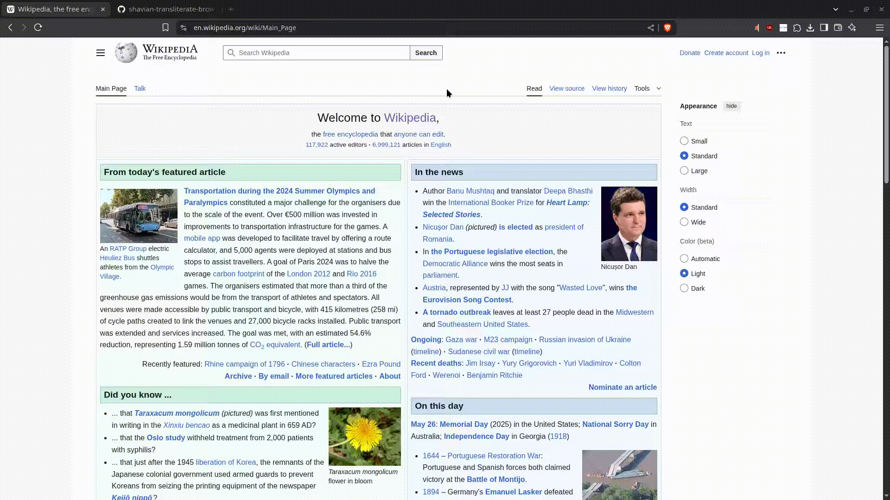

# 𐑖𐑱𐑝𐑾𐑯 𐑑𐑮𐑨𐑯𐑟𐑤𐑦𐑑𐑼𐑱𐑑 - Shavian Transliterate Browser Extension

[](https://github.com/DeepNestedSpider/shavian-transliterate-browser-extension)
[](LICENSE)
[](https://www.typescriptlang.org/)
[](https://bun.sh/)
[](https://github.com/DeepNestedSpider/shavian-transliterate-browser-extension)



A modern browser extension that automatically transliterates English text on web pages into the [Shavian alphabet](https://en.wikipedia.org/wiki/Shavian_alphabet) (𐑖𐑱𐑝𐑾𐑯). Built with TypeScript, Bun, and modern web standards using Manifest V3.

## ✨ Features

### 🔤 Intelligent Transliteration

- **Real-time conversion**: Automatically transliterates English text to Shavian script as pages load
- **Dynamic content support**: Monitors and transliterates content added via JavaScript using MutationObserver
- **Smart text recognition**: Uses `Intl.Segmenter` for accurate word boundary detection
- **Advanced transliteration engine**: Uses the readlexicon-based transliterator for accurate pronunciation-to-script conversion

### 🧠 Smart Content Detection

- **Language detection**: Recognizes English content using HTML `lang` attributes and Chrome's i18n API
- **Content filtering**: Intelligently avoids transliterating:
  - Code blocks (`<code>`, `<pre>`, `<xmp>`)
  - User input fields (`<input>`, `<textarea>`)
  - Embedded content (`<script>`, `<style>`, `<noscript>`, `<iframe>`)
  - Non-English scripts (IPA, Turkish, etc.)

### ⚙️ Flexible Configuration

- **Toggle transliteration**: Easy on/off switch via popup interface
- **Language detection modes**:
  - HTML lang attribute detection
  - Chrome i18n page detection
  - Force transliteration (override detection)

### 🎨 Modern Architecture

- **Manifest V3 compliant**: Built for the latest browser extension standards
- **TypeScript**: Full type safety and modern JavaScript features
- **Modular design**: Clean separation of concerns with dedicated modules for different functionalities
- **Performance optimized**: Minimal impact on page load times and browsing experience

## 🚀 Quick Start

### Installation

#### From Release (Recommended)

1. Download the latest release from the [releases page](https://github.com/DeepNestedSpider/shavian-transliterate-browser-extension/releases)
2. Extract the `.zip` file
3. Open Chrome/Chromium and navigate to `chrome://extensions/`
4. Enable "Developer mode"
5. Click "Load unpacked" and select the extracted folder

#### Build from Source

```bash
# Clone the repository
git clone https://github.com/DeepNestedSpider/shavian-transliterate-browser-extension.git
cd shavian-transliterate-browser-extension

# Install Bun (if not already installed)
curl -fsSL https://bun.sh/install | bash

# Install dependencies
bun install

# Build the extension
bun run build:dist

# The built extension will be in the ./dist/ folder
```

### Usage

1. **Install the extension** following the instructions above
2. **Click the extension icon** in your browser toolbar to open the popup
3. **Configure your preferences**:
   - Toggle transliteration on/off
   - Choose language detection method
   - Toggle transliteration direction
4. **Browse English websites** - text will be automatically transliterated to/from Shavian!

## 🛠️ Development

### Prerequisites

- [Bun](https://bun.sh/) - JavaScript runtime and package manager
- [TypeScript](https://www.typescriptlang.org/) - Type-safe JavaScript
- Modern web browser (Chrome, Firefox, Edge)

### Why This Project Exists

This browser extension was created to address several limitations in existing Shavian transliteration tools:

1. **Modernization**: Existing implementations use outdated code and Manifest V2
2. **Learning opportunity**: Explore Bun, TypeScript, and modern browser extension development
3. **Better user experience**: Provide a more reliable and feature-rich transliteration tool
4. **Performance**: Leverage modern web APIs for faster, more efficient transliteration
5. **Accuracy**: Existing implementations provided unsatisfactory results

### Development Setup

```bash
# Install dependencies
bun install

# Build for development
bun run build:dist

# Run tests
bun run test          # Run main test suite
bun run test:all      # Run all available tests

# Development utilities
bun run increment-version    # Bump version numbers
bun run convert-dict        # Convert readlexicon dictionary format
bun run clean              # Remove temporary and build files
```

### Build Commands

```bash
# Development build
bun run build:dist

# Production release (creates .zip and .tar.gz archives)
./build-release.sh        # Linux/macOS
```

### Project Architecture

```
📁 Project Structure
├── build-release.sh                  # Release build script
├── bun.lock                          # Bun lockfile
├── bunfig.toml                       # Bun configuration
├── github-release.sh                 # GitHub release script
├── package.json                      # Project metadata and scripts
├── README.md                         # Project documentation
├── tsconfig.json                     # TypeScript configuration
├── public/
│   ├── manifest.json                 # Extension manifest
│   └── icons/
│       ├── icon-128.png
│       ├── icon-16.png
│       └── icon-48.png
├── scripts/                          # Build and utility scripts
│   ├── build.ts
│   └── version.ts
├── showcase/
│   ├── wikipedia-video.gif
│   └── wikipedia-video.mp4
├── src/                              # TypeScript source code
│   ├── content.ts                    # Content script entry point
│   ├── languageDetector.ts           # Language detection utilities
│   ├── popup.html                    # Extension popup UI
│   ├── popup.ts                      # Extension popup logic
│   ├── readlexiconTransliterator.ts  # Alternative transliterator
│   ├── shavianTransliterator.ts      # Main transliterator
│   ├── core/
│   │   ├── domTransliterator.ts      # DOM manipulation utilities
│   │   ├── posTagger.ts              # POS tagging utilities
│   │   └── transliterationEngine.ts  # Main transliteration logic
│   ├── dictionaries/
│   │   ├── index.ts                  # Dictionary exports
│   │   └── readlex.ts                # Readlexicon dictionary
│   └── types/                        # TypeScript type definitions
└── tests/                            # Test files
```

## How It Works

1. **Extension Initialization**: The browser loads the extension using `manifest.json`, which injects `content.ts` as the main content script into web pages.
2. **Language & Content Detection**:
   - `languageDetector.ts` determines if the page (or specific elements) are in English using HTML `lang` attributes, Chrome's i18n API, and user preferences.
   - The script also checks for elements that should be excluded from transliteration (e.g., `<code>`, `<pre>`, `<input>`, `<textarea>`, `<script>`, `<style>`, `<iframe>`, etc.) using DOM queries and filtering logic in `core/domTransliterator.ts`.
3. **User Configuration**: The popup UI (`popup.html`/`popup.ts`) allows users to toggle transliteration, select detection modes, and set per-site preferences. These settings are stored and accessed by the content script.
4. **Transliteration Engine Selection**:
   - If English content is detected and transliteration is enabled, the content script dynamically loads the main transliteration engine (`shavianTransliterator.ts`).
   - For advanced or alternative transliteration, the `readlexiconTransliterator.ts` module is used, leveraging the `dictionaries/readlex.ts` data and `core/transliterationEngine.ts` logic.
5. **Text Processing & Replacement**:
   - The selected transliteration engine processes eligible text nodes, using `Intl.Segmenter` for accurate word boundaries and `core/posTagger.ts` for part-of-speech tagging when needed.
   - The transliterated Shavian text replaces the original content in the DOM, preserving structure and avoiding excluded elements.
6. **Dynamic Content Handling**:
   - A `MutationObserver` (in `content.ts` and/or `core/domTransliterator.ts`) watches for new or changed DOM nodes, ensuring that dynamically loaded or updated content is also transliterated in real time.
7. **Performance & Modularity**:
   - The codebase is modular, with clear separation between content detection, transliteration logic, dictionary data, and UI.
   - All processing is done locally for privacy and speed; no external requests are made during transliteration.

This architecture ensures accurate, efficient, and user-configurable transliteration of English web content into the Shavian script, while minimizing disruption to page functionality and user experience.

```bash
# Run specific test
bun run tests/test-refactored.ts

# Run all tests
bun run test:all
```

## 🗺️ Roadmap

### ✅ Completed Features

- ✅ **Modern Build System**: Bun-based build process with TypeScript
- ✅ **Core Transliteration**: Integration with readlexicon-based transliterator
- ✅ **Smart Content Filtering**: Avoids transliterating inappropriate content:
  - Code blocks (`<code>`, `<pre>`, `<xmp>`)
  - User input fields (`<input>`, `<textarea>`)
  - Embedded content (`<script>`, `<style>`, `<noscript>`, `<iframe>`)
  - Non-English scripts (IPA, Turkish, etc.)
- ✅ **Advanced Text Processing**: Word boundary detection with `Intl.Segmenter`
- ✅ **Language Detection**: HTML lang attributes and Chrome i18n API
- ✅ **User Interface**: Popup with configuration options:
  - Toggle transliteration on/off
  - Language detection method selection
  - Force transliteration option
- ✅ **Performance Optimization**: Reduce memory usage and improve speed by removing the to-shavian library
- ✅ **Modular Transliteration System**: Plugin-based architecture for multiple engines
- ✅ **Readlexicon Integration**: Translate Dechifro's Python shavianizer to JavaScript and Implement the Readlexicon dictionary
- ✅ **Both ways transliteration**: Transliterate shavian to Latin Alphabet

### 🎯 High Priority

- [ ] **Advanced Punctuation Support**: Support transliterating the punctuatuions such as "" to ‹›

#### Low Complexity

- [ ] **UI/UX Improvements**: Enhanced popup design and user experience
- [ ] **Better Error Handling**: Graceful fallbacks for edge cases
- [ ] **Custom Font Support**: Allow users to specify preferred Shavian fonts
- [ ] **Keyboard Shortcuts**: Hotkeys for quick transliteration toggle

#### High Complexity

- [ ] **Multi-language Support**: Extend beyond English to other languages that have alternate scripts
- [ ] **User input transliteration (both ways)**: Share transliterated content with others

#### Core Runtime

- **Bun**: Modern JavaScript runtime and package manager
- **TypeScript 5.x**: Type-safe JavaScript with latest features
- **compromise**: Natural language processing library for POS tagging

#### Development

- **@types/chrome**: Chrome extension API type definitions
- **@types/node**: Node.js type definitions
- **@types/bun**: Bun runtime type definitions

### Browser Compatibility

- ✅ **Chrome/Chromium**: Full support (primary target)
- ✅ **Edge**: Full support (Chromium-based)
- ⚠️ **Firefox**: Partial support (some Manifest V3 features may differ)
- ❌ **Safari**: Not currently supported (different extension system)

### Performance Characteristics

- **Memory Usage**: Reevaluating this data
- **CPU Impact**: Reevaluating this data
- **Load Time**: Reevaluating this data
- **Network**: No external requests (all processing local)

## 🤝 Contributing

We welcome contributions! Here's how you can help:

### Getting Started

1. Fork the repository
2. Create a feature branch: `git checkout -b feature/amazing-feature`
3. Make your changes and test thoroughly
4. Commit with clear messages: `git commit -m 'Add amazing feature'`
5. Push to your fork: `git push origin feature/amazing-feature`
6. Open a Pull Request

### Code Style

- Use TypeScript for all new code
- Follow existing naming conventions
- Add tests for new functionality
- Update documentation as needed

### Areas for Contribution

- 🐛 **Bug Fixes**: Check the issues page for known problems
- ✨ **Features**: Implement items from the roadmap
- 📚 **Documentation**: Improve README, add code comments
- ✅ **Testing**: Add more comprehensive test coverage
- 🎨 **UI/UX**: Enhance the popup interface and user experience

## 📄 License

This project is licensed under the MIT License - see the [LICENSE](LICENSE) file for details.

## 🙏 Acknowledgments

- **[Shaw Alphabet](https://www.shavian.info/)**: For preserving and promoting the Shavian script
- **[Readlexicon Project](https://readlexicon.org/)**: Origin of the dictionary file
- **[Dechifro's Transliterator](https://dechifro.org/shavian/)**: Inspiration for the custom transliteration engine
- **[to-shavian](https://nwah.github.io/to-shavian/)**: Transliteration engine used for prototyping(Deprecated)

- **Community**: Shavian alphabet enthusiasts and contributors

## 📞 Support

- 🐛 **Bug Reports**: [GitHub Issues](https://github.com/DeepNestedSpider/shavian-transliterate-browser-extension/issues)
- 💡 **Feature Requests**: [GitHub Discussions](https://github.com/DeepNestedSpider/shavian-transliterate-browser-extension/discussions)
- 📧 **Direct Contact**: Create an issue on GitHub
- 💬 **Community**: [GitHub Discussions](https://github.com/DeepNestedSpider/shavian-transliterate-browser-extension/discussions)

---

**Made with ❤️ on a Steam Deck running Bazzite/Archlinux using NeoVim + AstronVim**

_This extension is not affiliated with the Shaw Estate or any official Shavian alphabet organization._
