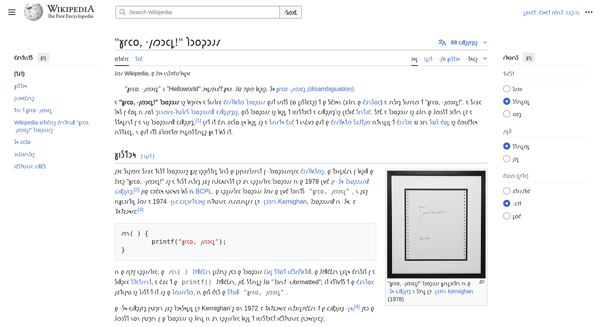

# shavian-transliterate-browser-extension

This project uses to-shavian as the engine, and bun as the packager

To install dependencies:

```bash
bun install
```

To build a release:

```bash
chmod +x ./release.sh
./release.sh
```



# ToDo

- [x] Tranliterate text to shavian
- [ ] On/off switch on popup menu
- [ ] Only transliterate when page's language is english
- [ ] Create my own transliteration implementation

This project was created using `bun init` in bun v1.2.13. [Bun](https://bun.sh) is a fast all-in-one JavaScript runtime.
